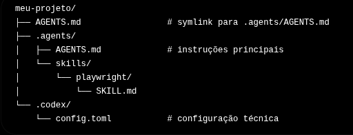

# About Ladys Wiki Project

Este repositório tem o intuíto de ponto de partida de organização de documentação em projetos com IA. Caso de estudo em desenvolvimento, que serve como base para iniciar uma documetação focando nas regras de negócio de cada projeto.

---

## Objetivo

Ter uma base inícial "template" para copiar e adicionar no projeto, com fontes e referências de estudos voltado para wiki em projetos.

## Referências

- [Documentação AI CODEX](https://developers.openai.com/)
- [Rules OpenAI Dev](https://developers.openai.com/codex/rules)

---
